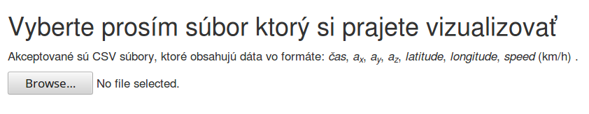

# Driving Style Visualizer

This application provides various views to help the analysis of the collected data with primary focus on detection of aggressive driving behaviour.

## Input file
The application takes as input a CSV text file with arbitrary amount of rows.

 Translation: _Please select a file which you'd like to visualize._
 
### Input format
The format of the input file is the following: 
_time_; _ax_; _ay_; _az_ ; _latitude_; _longitude_; _speed_

where each row represents a set of measured values at a given time:
- _time_  - the time when the values were measured as a Unix timestamp,
- _ax_ - acceleration on _x_ axis;
- _ay_ - acceleration on _y_ axis;
- _az_ - acceleration on _z_ axis;
- _latitude_ - geographical latitude (in decimal format);
- _longitude_ - geographical longitude (in decimal format);
- _speed_ - moving speed in km.h-1. 

### Source of input
A source for compatible input file can be gathered from the _Driving Style Measurer_ application which is intended for taking measurements: 
https://github.com/zsolt-racz/driving-style-measurer

## User interface
After selecting a proper input file, the application immediately processes and switches into visualization mode. The application provides two switchable views.

### Visualization on map

### Visualization using table and graphs

## About the project
This project has been developed as part of bachelor thesis _Utilization of a mobile phone for measuring driver's aggression and traffic flow_ by [_Zsolt Rácz_](https://zsoltracz.com/).

The thesis is available here (in Slovak language): 
https://opac.crzp.sk/?fn=detailBiblioForm&sid=C7DA6C94B65F4BF8496F52FAED0E

